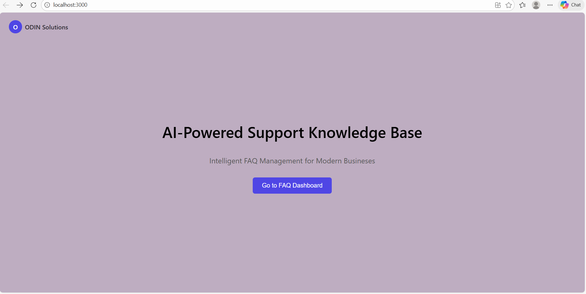
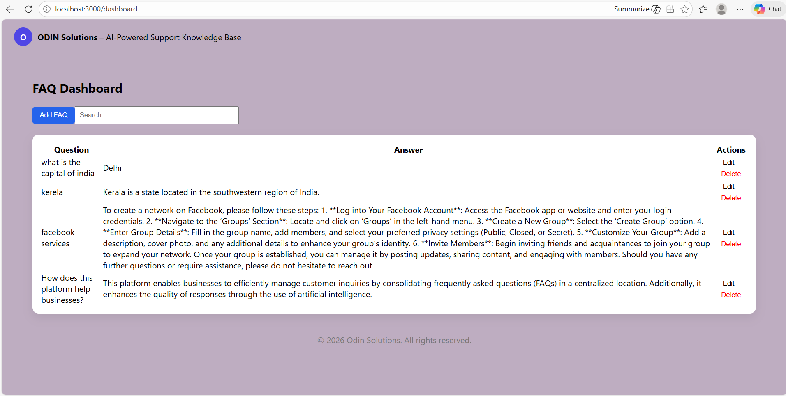
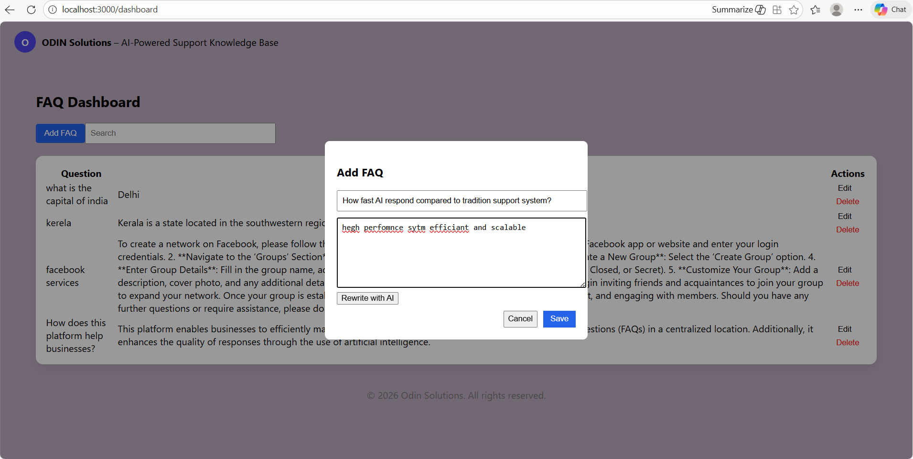
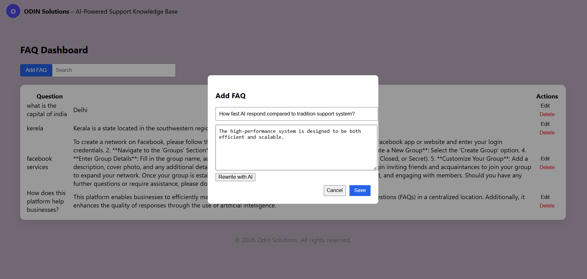
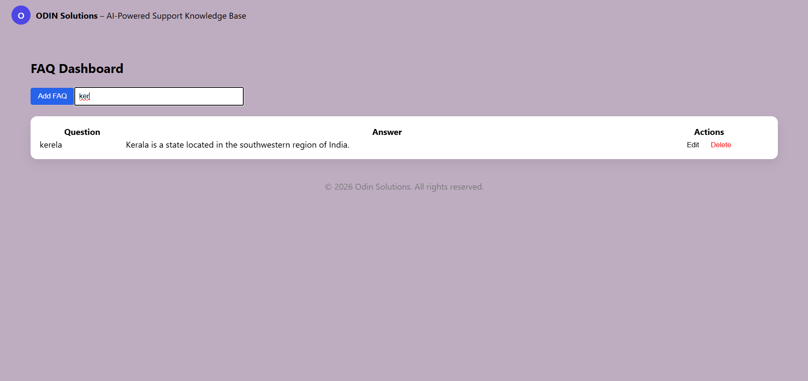
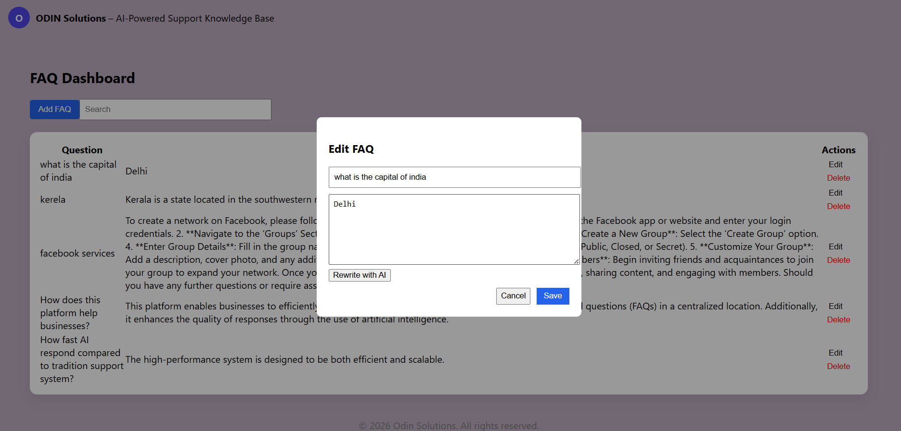
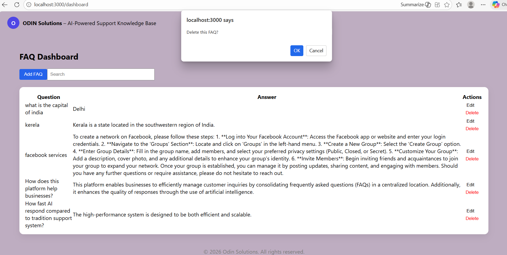

											AI-Powered FAQ Management System

ODIN Technologies – Developer Assessment Task

Project Overview

The AI-Powered FAQ Management System is a full-stack web application developed as part of the ODIN Technologies Developer Assessment Task.The main objective of this project is to help organizations efficiently manage Frequently Asked Questions (FAQs) while also improving the quality of answers through optional AI assistance. The application allows users to add, view, edit, delete, and search FAQs, making content management simple and effective.An AI-based rewrite feature is included to enhance the clarity and professionalism of answers. This feature is optional and designed to assist users rather than replace manual input. The overall system is intentionally kept simple, user-friendly, and easy to extend for future improvements.

## Features Implemented
~Landing Page
Displays the project title: “AI-Powered Support Knowledge Base”:Provides a short description explaining the purpose of the application.Includes a button to navigate to the FAQ Dashboard

~FAQ Dashboard
Displays all FAQs in a structured table format.Shows the Question, Answer, and available Actions.Includes a search bar to filter FAQs based on question text.Provides an option to add new FAQs and also option to rewrite by ai that send text to backend and rewrite more efficiently and proffesionly and it will be save by clicking save button and also displays.

## FAQ Management (CRUD Operations)
Add FAQ
Opens a modal with input fields for question and answer,Validation ensures both fields are filled before saving

Edit FAQ
Opens a modal pre-filled with the selected FAQ data.Allows users to update existing FAQs easily

Delete FAQ
Requires user confirmation before deletion to prevent accidental data loss

AI Rewrite Feature
Available inside the Add/Edit FAQ modal.Sends the current answer to the backend for processing.Uses an AI model to rewrite the answer in a clearer and more professional tone,The rewritten answer replaces the existing text but remains fully editable.This feature is optional and does not affect standard CRUD functionality

## Technology Stack
~Frontend
React.js with TypeScript
Axios for API communication
Inline CSS for simple and readable styling

~Backend
Node.js
Express.js
RESTful API architecture using standard HTTP methods

~Database
SQLite for lightweight local storage
Prisma ORM for database schema management and queries

~AI Integration
OpenAI API for rewriting FAQ answers
API key handled securely using environment variables

## Project Folder Structure
odin/
│
├── backend/
│   ├── prisma/
│   │   └── dev.db
│   ├── server.js
│   └── package.json
│
├── frontend/
│   ├── src/
│   │   └── components/
│   │       └── Dashboard.tsx
|   |       |__Landing.tsx 
│   └── package.json
│
├── screenshots/
│   ├── landing-page.png
│   ├── dashboard.png
│   └── add-edit-modal.png
│
├── .gitignore
└── README.md

## Backend API Endpoints

GET /faqs
Fetch all FAQs

POST /faqs
Create a new FAQ

PUT /faqs/:id
Update an existing FAQ

DELETE /faqs/:id
Delete a FAQ

POST /ai/rewrite
Rewrite an FAQ answer using AI

## Environment Configuration

Create a .env file inside the backend folder with the following content:
~OPENAI_API_KEY=your_openai_api_key_here
The .env file is excluded from version control to ensure security.

## Setup Instructions
Step 1: Clone the Repository
git clone <your-github-repo-url>
cd odin

Step 2: Backend Setup
cd backend
npm install
node server.js

The backend server will run on:

http://localhost:5000

Step 3: Frontend Setup
cd frontend
npm install
npm start

The frontend application will run on:
http://localhost:3000

## Assumptions and Notes

Authentication was not implemented as it was not required for this assessment
SQLite was selected for simplicity and ease of local development
The AI rewrite feature is assistive and optional
The project structure supports easy extension for future features such as authentication or deployment

## Conclusion

This project successfully fulfills all functional and technical requirements specified in the ODIN Technologies Developer Assessment Task.It demonstrates practical full-stack development skills, clean REST API design, database handling using an ORM, and responsible AI integration. The codebase is structured to be simple, readable, and maintainable, making it easy to understand during technical discussions and interviews.

## Screenshots

Landing Page

FAQ Dashboard

Add / Edit /Search/Rewrite/Delete FAQ

